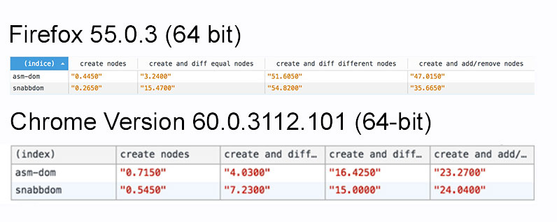

# Benchmarks

---

**Please read the entire file, there are some considerations that explain the results at the end of this page**

---

In this directory you can find some code to measure the performance of asm-dom. In particular you can find the results of asm-dom and [snabbdom](https://github.com/snabbdom/snabbdom), this allows you to make a comparison between the performance of asm-dom and a js virtual DOM. Before jumping to conclusions please read this list, this underline some important aspects:

- asm-dom aims to let you write high perfomance SPA (Single page applications) in C++ that will be compiled into WebAssembly. This means that they will run until 4 times faster. However asm-dom needs to update the DOM and unfortunately, at the moment, this involves javascript. So, the internals of asm-dom will call js for you and they will deal with the overhead of the binding between JS and WASM. In the future, without these bindings, asm-dom will be even more powerful, however, you have to be aware that, for this reason, **the results that you will see later won't represent the performance of your entire app, your code, your algorithms and so on will be a lot faster (they will be like the second test where there are no js calls). asm-dom will be the only place that will deal with the overhead of the js <-> wasm communication.**

- asm-dom does not leave garbage after the execution of its tests, while snabbdom might leave some garbage that need to be collected by the garbage collector.

There are 4 tests at the moment:

- `create nodes`: this test create 700 nodes (100 nodes with 3 children, the last of which has 3 more children). Please note that, as we said before, **in the case of asm-dom, this test creates but also destroys the nodes**. While, in the case of snabbdom, the deletion is managed by the garbage collector and it is not measured.

- `diff equal nodes`: this test runs the `patch` function 100 times with 2 equal nodes (2 nodes with 100 children, each of them has 1 child), so, the DOM will be not updated.

- `diff different nodes`: this test runs the `patch` function 100 times with 2 nodes with different attributes (2 nodes with 100 children, each of them has 1 child), so, the DOM will be updated.

- `add/remove nodes`: this test runs the `patch` function 100 times with 2 nodes, one with 100 children and one without children.

Here you can find screenshots of the tests (lower is better) runned on a MacBook Pro (Retina, 13-inch, Late 2013), Processor 2,4 GHz Intel Core i5, Memory 8 GB 1600 MHz DDR3:

